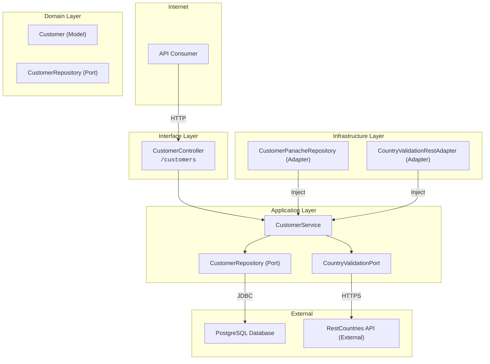

# Diagrama de Componentes – Customer API

Este diagrama presenta la **arquitectura lógica** del servicio siguiendo un enfoque Clean / Hexagonal. Se muestran las **cuatro capas conceptuales** —Interface, Application, Domain y Infrastructure— con sus componentes principales, de modo que la **lógica de negocio permanezca aislada** de la infraestructura y las dependencias fluyan siempre hacia adentro. Las flechas indican **protocolos (HTTP, JDBC, HTTPS)** y la dirección de dependencia, facilitando la comprensión del *flow* y los puntos de inyección.

---

## 🧱 Componentes principales

> 🔍 La capa de dominio contiene los modelos puros, interfaces y los puertos que definen contratos de persistencia y lógica externa. 

---

## 🔍 Detalles clave

* **CustomerController** expone los endpoints REST de la API.
* **CustomerService** orquesta la lógica de negocio y delega a puertos.
* **CustomerRepository (Port)** define la interfaz de persistencia.
* **CustomerPanacheRepository** es el adapter concreto que implementa la persistencia vía Panache.
* **CountryValidationPort** abstrae la lógica de validación de países (hexagonal).
* **CountryValidationRestAdapter** conecta con la API externa restcountries.com.

---

## 🌐 Conexiones

* HTTP del cliente a la API
* JDBC entre Quarkus y la base de datos PostgreSQL
* HTTPS para la validación externa de país

---

## 🧱 Principios aplicados

* **Inversión de dependencias**: capa de dominio no depende de infraestructura
* **Separación de responsabilidades**: cada capa tiene una única función
* **Abstracción de puertos y adaptadores**: facilita pruebas, mantenibilidad y escalabilidad

---

## ✍️ Autor

Víctor Velázquez Cid [https://github.com/vvelc](https://github.com/vvelc)
