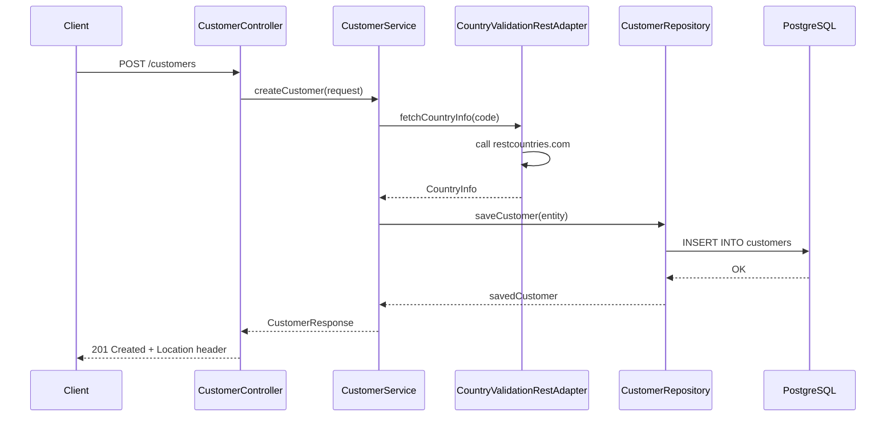
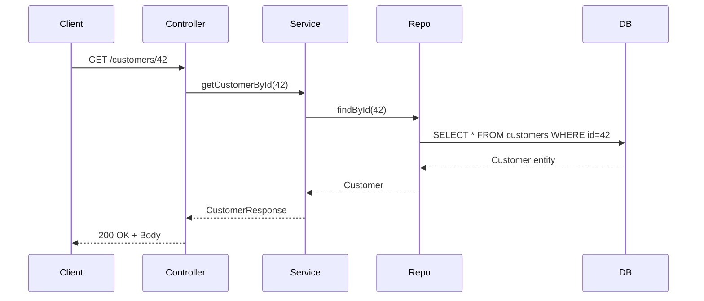
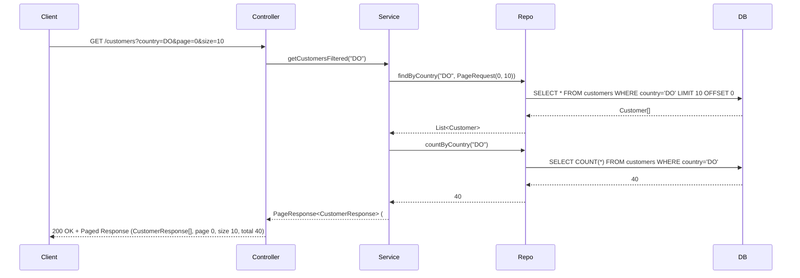
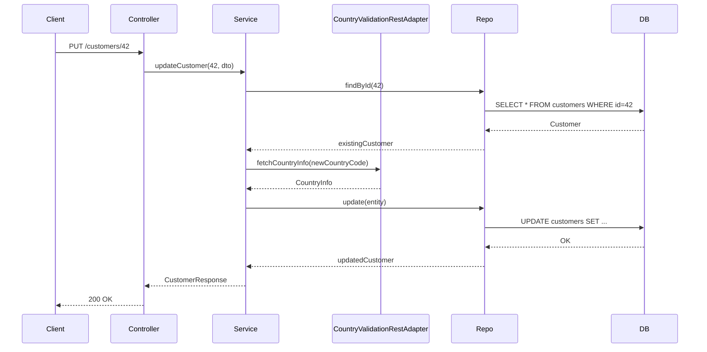
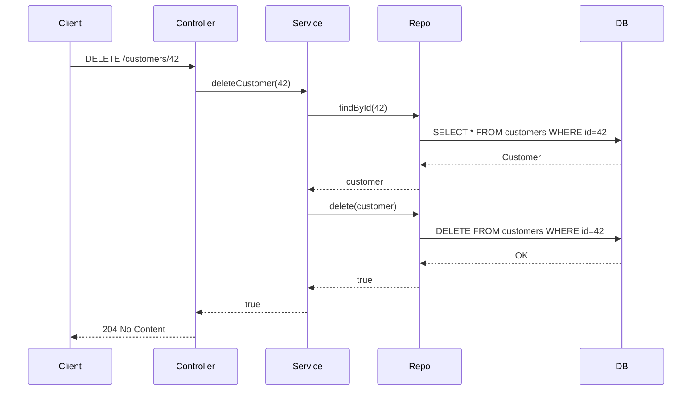
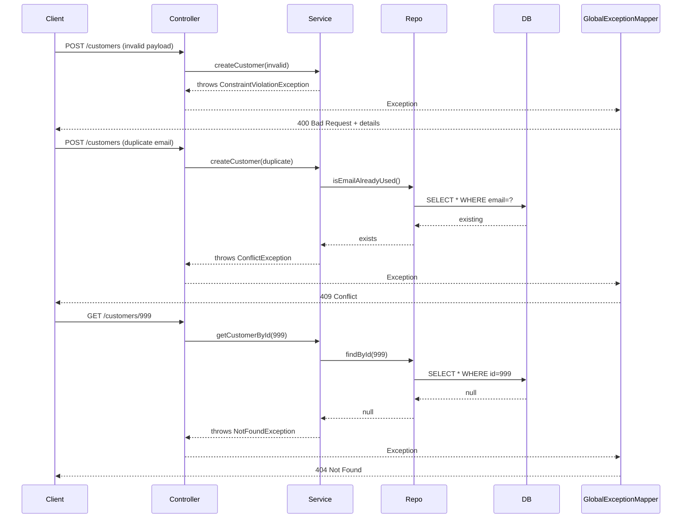

# Diagramas de Flujo – Customer API

Este documento contiene los principales flujos de interacción de la API de clientes, representados con diagramas Mermaid para facilitar el entendimiento de los procesos clave.

---

## ✅ Flujo 1 – Crear cliente (`POST /customers`)

---

## ✅ Flujo 2 – Obtener cliente por ID (`GET /customers/{id}`)

---

## ✅ Flujo 3 – Listar clientes por país (`GET /customers?country=DO`)

---

## ✅ Flujo 4 – Actualizar cliente (`PUT /customers/{id}`)

---

## ✅ Flujo 5 – Eliminar cliente (`DELETE /customers/{id}`)

---

## ✅ Flujo 6 – Manejo de errores (valores inválidos, duplicados, no encontrado)

---

## 🧭 Visualización

Para visualizar los diagramas, puedes pegar su codigo en  [https://mermaid.live](https://mermaid.live), o abrirlos directamente en GitHub Pages, VS Code o herramientas compatibles.

---

## ✍️ Autor

Víctor Velázquez Cid [https://github.com/vvelc](https://github.com/vvelc)
